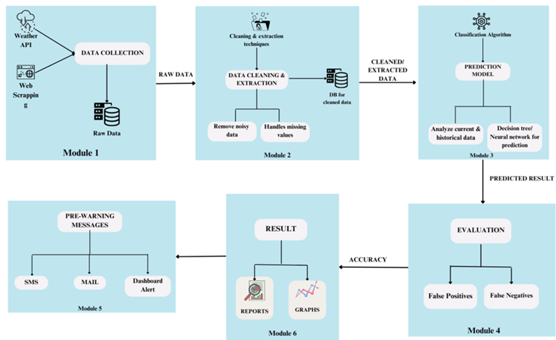
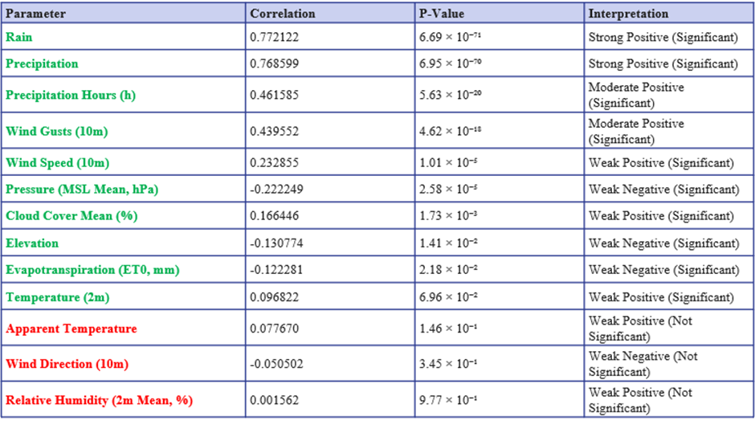
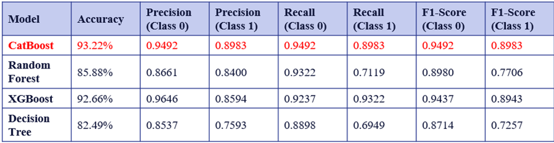
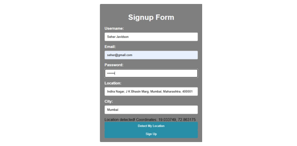
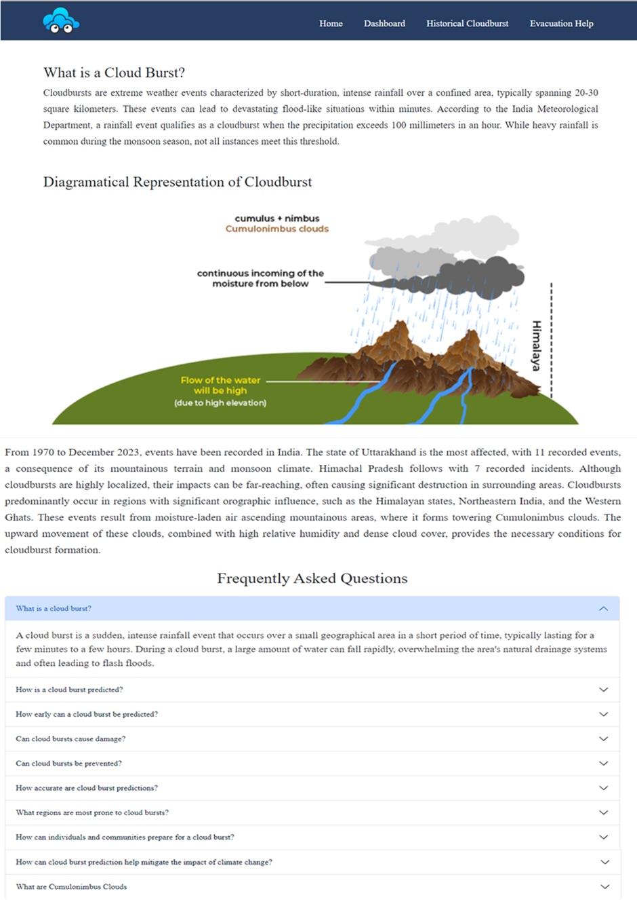
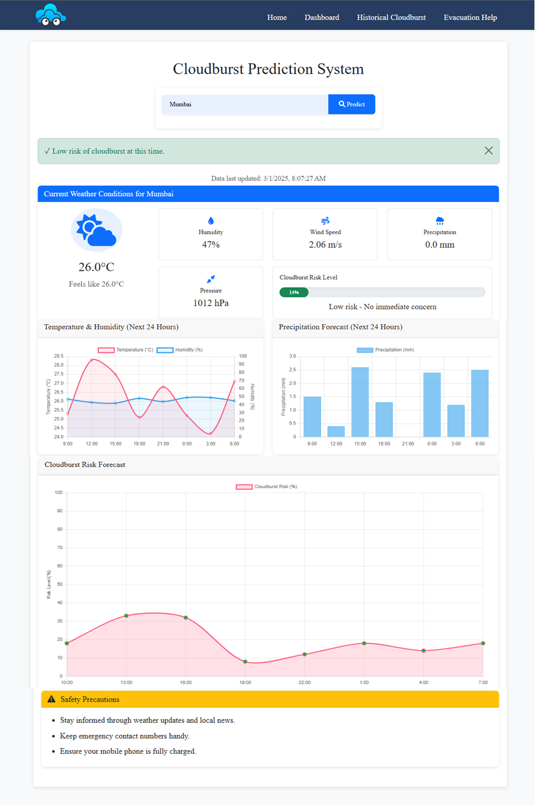
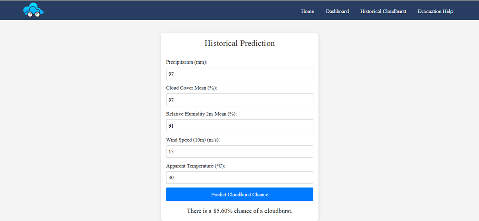
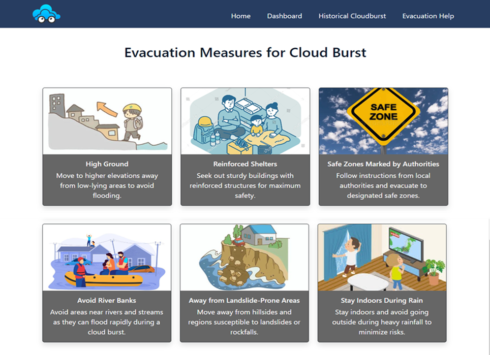
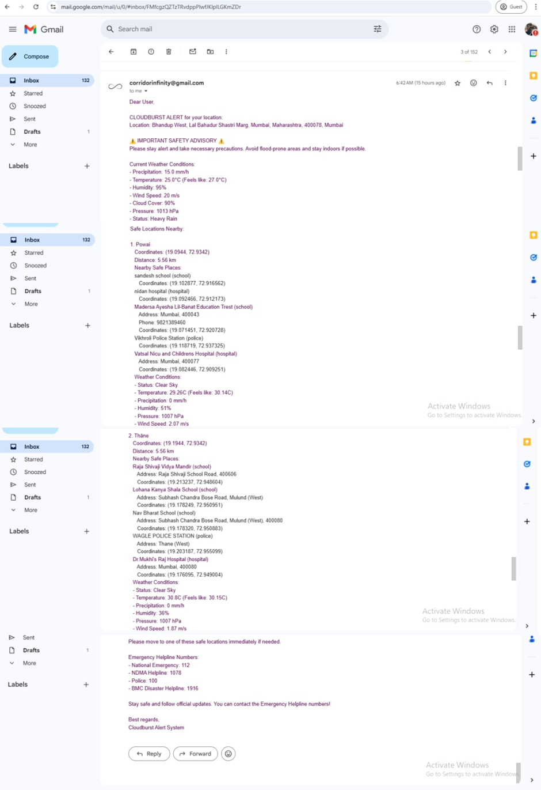
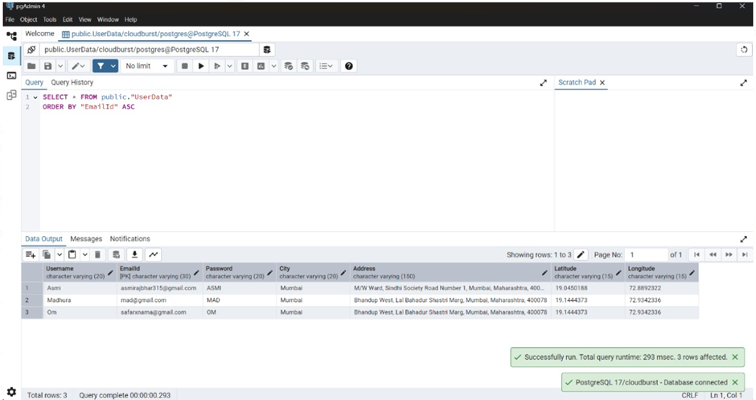

# 🌩️ CloudEye

**CloudEye** is a full-stack web application designed to predict the **likelihood of cloudbursts** across India using historical weather data and machine learning. It provides an intuitive user interface for entering weather parameters and receives predictions in real-time based on a trained **CatBoost model**.

---

## 🚀 Features

- 🔮 **Cloudburst Prediction**
  - Enter weather parameters like temperature, precipitation, humidity, wind, and more to receive a prediction using a CatBoost classification model.

- 📊 **ML Model Powered**
  - Built on top of **CatBoost**, trained with features such as precipitation, humidity, wind gusts, cloud cover, etc.

- 🌐 **State & District-Wide Coverage**
  - Designed to scale with regional data to analyze cloudburst chances across various Indian states and districts.

- 🖼️ **User-Friendly Frontend**
  - Clean and responsive frontend using **HTML**, **CSS**, and **JavaScript**.

- 🗃️ **PostgreSQL Database Integration**
  - Stores historical records, prediction logs, and user inputs securely for analysis and insights.

---

## 🛠️ Tech Stack

| Layer        | Stack                                         |
|--------------|-----------------------------------------------|
| **Frontend** | HTML5 · CSS3 · JavaScript                     |
| **Backend**  | Python · CatBoost · Flask/FastAPI (optional)  |
| **Database** | PostgreSQL                                    |
| **ML Model** | CatBoost Classifier (trained via Google Colab)|

---

## 📈 Model Details

Trained on: Historical cloudburst-related weather data

Features Used:

Temperature, Precipitation, Wind Speed/Gusts, Cloud Cover

Relative Humidity, Atmospheric Pressure, Elevation, etc.

Output: Binary prediction — Cloudburst or No Cloudburst

## 🛠️ Project Setup
**Open Website:** Open index.html from the Cloudburst Prediction folder in your browser.

**Run the following in separate terminals:**

**Terminal 1:**

cd frontend/RealTime

python app.py

**Terminal 2:**

cd frontend/Historical

python app1.py

**Terminal 3:**

cd /frotnend/Email

python cloudburst_checker.py

## 📊 Important Diagrams
### 🔹Modular Diagram

### 🔹 Dataset Curation

### 🔹 Comparison Of Model Accuracy

## 📷 Project Screenshot
### 🔹Splash Screen

### 🔹SignUp Screen

### 🔹Home Screen

### 🔹RealTime Prediction Screen

### 🔹Historical Prediction Screen

### 🔹Evacuation Information Screen

### 🔹Email

### 🔹Database

